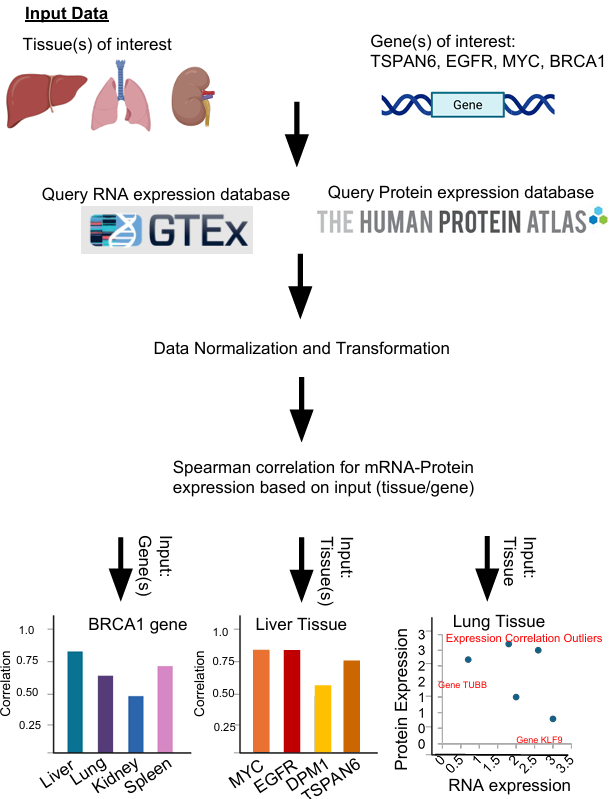
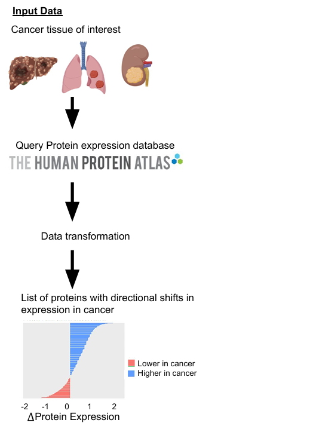

<!-- README.md is generated from README.Rmd. Please edit that file -->

```{r, include = FALSE}
knitr::opts_chunk$set(
  collapse = TRUE,
  comment = "#>",
  fig.path = "man/figures/README-",
  out.width = "100%"
)
```

# ExprCompareR

<!-- badges: start -->
<!-- badges: end -->

Statistical comparison and visualization of transcript-protein relationships.

## Description

`ExprCompareR` is an R package designed to streamline the exploration and quantification of the relationship between RNA expression and protein expression across human tissues and conditions. Researchers studying post-transcriptional regulation currently face the time-consuming task of manually retrieving RNA-seq and protein-expression data, filtering, normalizing, computing correlations, and creating visualizations for their genes of interest. `ExprCompareR` automates and integrates these steps, providing a user-friendly workflow to quickly retrieve transcriptomic and proteomic data from public repositories such as the Genotype-Tissue Expression Project (GTEx)(Lonsdale et al., 2013) and the Human Protein Atlas (HPA)(Thul et al., 2018), compute correlations, flag outlier genes, and visualize results. The package also facilitates the comparison of protein expression between diseased and healthy tissues, offering tissue-specific insights and statistical analyses. Unlike existing tools that focus on either RNA or protein expression alone, `ExprCompareR` enables direct comparisons between RNA and protein levels, making it a novel and valuable resource for bioinformatics researchers, computational scientists, and students interested in tissue-specific expression, post-transcriptional regulation, or biomarker discovery.

ExprCompareR analyzes two types of biological data: RNA-expression data and protein expression data. This data is queried from established databases, namely the Genotype-Tissue Expression Project (GTEx)(Lonsdale et al., 2013) and Human Protein Atlas (HPA)(Thul et al., 2018).

The RNA-expression data from GTEx has been derived from GTEx healthy donors and measures the amount of mRNA produced by each gene in various tissues. This data is available in Transcripts Per Million (TPM), and organized in tabular form, where the rows depict the gene expression, while the columns are tissue type, gene name, gene expression, etc. (Lonsdale et al., 2013)

The protein-expression data from Human Protein Atlas, has been derived from HPA healthy and diseases tissue samples, and measures the abundance of proteins in various tissues, and is organized in a tabular form, having columns such as gene, tissue, level, reliability etc. This has been measured by techniques like immunohistochemistry and mass spectrometry (Thul et al., 2018).

As the  transcriptomic data and proteomic data come from different sources and different individuals, technical and biological variation can cause limitations in our package. However, our package transforms and normalizes data to achieve a fair comparison.

The targeted audience for `ExprCompareR` are bioinformatics researchers, computational scientists or even students who are interested in exploring the relationship between gene expression at RNA and protein levels. Specifically, this package is designed for users who are interested in finding candidates for post-transcriptional regulation or studying tissue-specific RNA and protein expression or even biomarker discovery. 
Additionally, as `ExprCompareR` provides statistical/correlation analysis of RNA-seq and protein expression data sets as well as visualization tools, it can cater to users who are interested in utilizing these aspects as well.

ExprCompareR is a combination of two words: Expression and Compare as the package deals with comparing RNA-seq expression and protein expression data.


`ExprCompareR` was developed using:

R version: 4.4.2 (2024-10-31 ucrt)

Platform: x86_64-w64-mingw32/x64

Running under: Windows 11 x64 (build 26100)

## Installation

To install the latest version of the ExprCompareR package:

```r
install.packages("devtools")
library(devtools)

devtools::install_github("tanaya2026/ExprCompareR", build_vignettes = TRUE)

library(ExprCompareR)


```

## Overview


```r
library("ExprCompareR")
ls("package:ExprCompareR")
data(package = "ExprCompareR") 
browseVignettes("ExprCompareR")

```

`ExprCompareR` contains four main user-accessible functions:

1. ***compute_correlation*** - Computes spearman correlations across a set of genes **or** tissues of interest returns a plot summarizing the results. `compute_correlation` acts as a wrapper function and depending on the input, it calls either `correlation_genes_only()` or `correlation_tissues_only()` internally.
2. ***correlation_genes_tissues*** - Computes spearman correlations across a set of genes **and** tissues of interest returns a plot summarizing the results.Users can choose to visualize per gene or per tissue.
3. ***detect_outliers*** – Identifies genes in a given tissue that show large differences between RNA and protein expression and highlights them in a plot.
4. ***compareCancerProtein*** – Compares protein expression between normal and cancer tissues for a specified cancer type, providing a summary table and bar plot of rank changes.


The package has prebuilt datasets like `normal_tissue` and `pathology`, to avoid dynamically downloading the protein expression datasets each time. Refer to `help` documentation for information on data.

An overview of the package is illustrated below:

**Image 1:** Depicts the functionality of functions compute_correlation, correlation_genes_tissues and detect_outliers.


 
 
 
 
 **Image 2:** Depicts the functionality for function compareCancerProtein.
 
 
 
 
 

## Contributions

The author of the package is Tanaya Datar. ExprCompareR contains 4 main functions and 3 helper functions. The idea, execution, and code structure for all functions was done by the author. All of our functions depend on protein expression and RNA-seq data that is queried using packages HPAanalyze(Tran et al., 2019) and gtexr's(Warwick et al., 2025) built in functions, that query the GTEx (Lonsdale et al., 2013) and HPA (Thul et al., 2018) databases for specific tissues and genes depending on the user input. Specifically we used  `hpadownload` from HPAanalyze(Tran et al., 2019) to query protein expression data and `get_top_expressed_genes` `get_gene_expression` from gtexr (Warwick et al., 2025) to query RNA seq data. Additionally, package `dplyr` (Wickham et al., 2025)'s  `filter`, `pull`, `group_by`, `summarise`, `mutate`, `select` functions was used in all four functions(compute_correlation,correlation_genes_tissues, detect_outliers, compareCancerProtein)to filter and structure RNA and protein data that was queried, to perform analysis. Package `tidyr` (Wickham et al., 2025) `drop_na` function was used to drop NA values in `outlier_detection` `compute_correlation`. Package `tibble`(Muller K, Wickham H, 2025)`tibble` function was used to generate tibbles for analysis in `correlation_genes_tissues`.
Package `purr` (Wickham et al., 2025) `map_dbl` and `map` function was used to map RNA and protein expression for each gene in `correlation_genes_tissues`.Package `stats`(R Core Team, 2024) and `utils` (R Core Team, 2024) `quantile`, `reorder` and `utils` were used to filter data for analysis. Package `ggplot2` (Wickham H, 2016)'s `ggplot` function was used to create scatter plots in `outlier_detection`, bar plots in `compute_correlation` and `correlation_genes_tissues`, and  directional plots in `compareCancerProtein` for visualization.

Additionally BioRender(BioRender.com. BioRender [Online], accessed 2 November 2025), was used to generate the images used in the Overview Section of the README.

ChatGPT was used across the functions to debug errors and to refine the wording used in the roxygen tags. ChatGPT was also used to resolve the errors that were caught during unit tests. Other than this, generative AI was NOT used for core code/ideas/problem solving, and all other work was done by the author.

## References

* BioRender.com. BioRender [Online]. Available at: https://www.biorender.com (accessed 2 November 2025).

* Lonsdale, J., Thomas, J., Salvatore, M. et al. The Genotype-Tissue Expression (GTEx) project. Nat Genet 45, 580–585 (2013). https://doi.org/10.1038/ng.2653

* Müller K, Wickham H (2025). tibble: Simple Data Frames. R package version 3.3.0, https://tibble.tidyverse.org/. to list!!

* OpenAI.(2025). ChatGPT (GPT-5) [Large language model]. Retrieved November 2, 2025, from https://chatgpt.com/

* R Core Team (2024). _R: A Language and Environment for Statistical Computing_. R Foundation for Statistical Computing, Vienna, Austria. <https://www.R-project.org/>.

* Thul, P. J., & Lindskog, C. (2018). The human protein atlas: A spatial map of the human proteome. Protein science : a publication of the Protein Society, 27(1), 233–244. https://doi.org/10.1002/pro.3307

* Tran AN, Dussaq AM, Kennell Jr T, Willey CD, Hjelmeland AB (2019). “HPAanalyze: an R package that facilitates the retrieval and analysis of the Human Protein Atlas data.”
MC Bioinformatics 20, 463 (2019). https://doi.org/10.1186/s12859-019-3059-z

* Warwick A, Zuckerman B, Ung C, Luben R, Olvera-Barrios A (2025). “gtexr: A convenient R interface to the Genotype-Tissue Expression (GTEx) Portal API.” Journal of Open Source Software, 10(109), 8249. ISSN 2475-9066, doi:10.21105/joss.08249, gigs v0.2.1. 

* Wickham H (2016). ggplot2: Elegant Graphics for Data Analysis. Springer-Verlag New York. ISBN 978-3 319-24277-4, https://ggplot2.tidyverse.org. 

* Wickham H, François R, Henry L, Müller K, Vaughan D (2025). dplyr: A Grammar of Data Manipulation. R package version 1.1.4, https://dplyr.tidyverse.org.

* Wickham H, Henry L (2025). purrr: Functional Programming Tools. R package version 1.1.0, https://purrr.tidyverse.org/.

* Wickham H, Vaughan D, Girlich M (2025). tidyr: Tidy Messy Data. R package version 1.3.1, https://tidyr.tidyverse.org.


## Acknowledgements

This package was developed as part of an assessment for 2025 
BCB410H: Applied Bioinformatics course at the University of
Toronto, Toronto, CANADA. `ExprCompareR` welcomes issues,
enhancement requests, and other contributions. To submit an issue,
use the GitHub issues.
