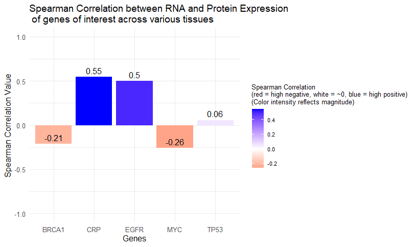
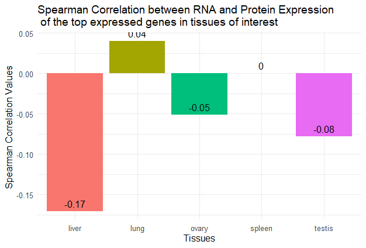
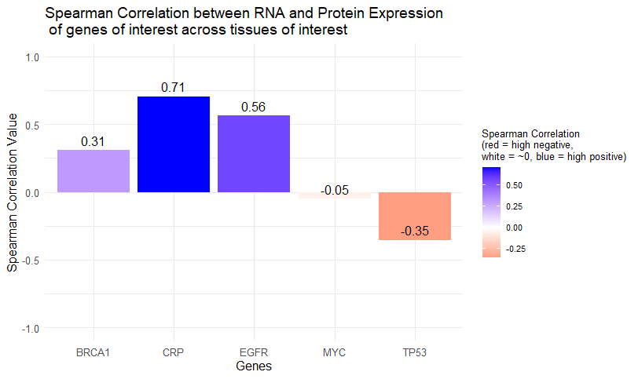
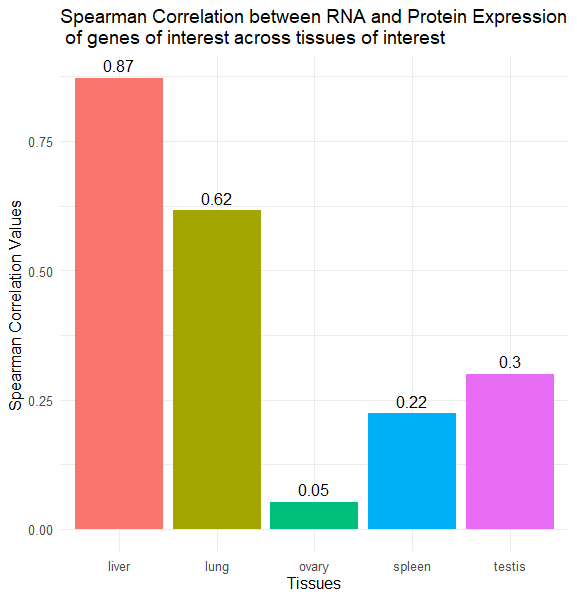
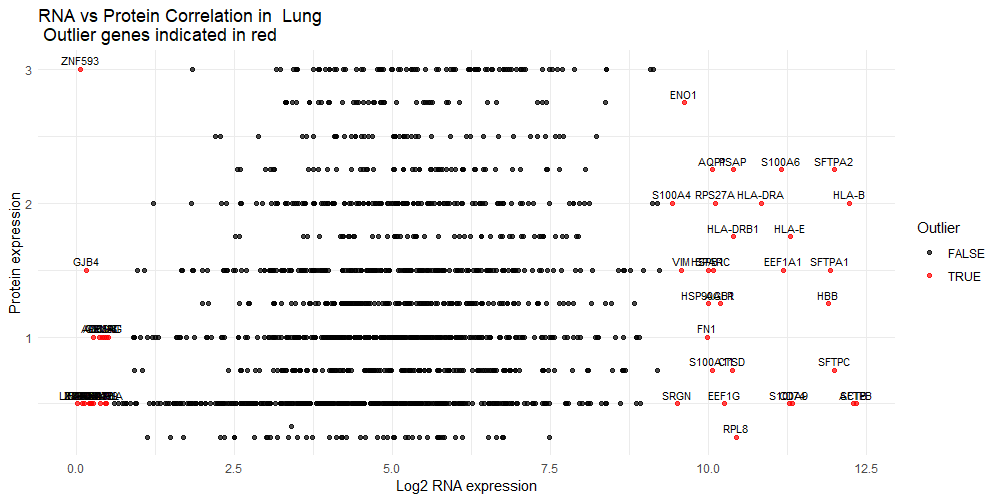
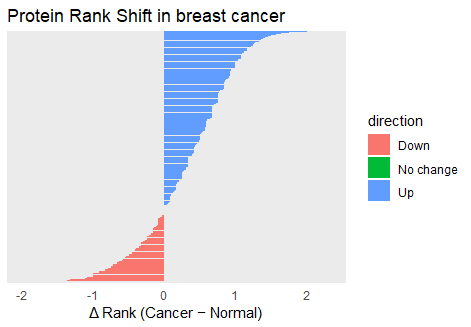

```{r, include = FALSE}
knitr::opts_chunk$set(
  collapse = TRUE,
  comment = "#>"
)
```
# Introduction

**ExprCompareR** is a package designed to allow researchers and computational biologists to easily explore and quantify the relationship between RNA-seq and protein expression across various tissues and conditions. ExprCompareR provides functions for calculating and plotting the Spearman correlation of RNA-seq and protein expression data from the user's genes and tissues of interest.

Additionally, ExprCompareR includes functionalities for detecting outlier genes i.e., genes that show large discrepancies between RNA and protein expression and for comparing protein expression between cancer and healthy tissues.

This document gives a quick tour of **ExprCompareR** (version 0.1.0)  functionalities. It was written in R Markdown, using the [knitr](https://cran.r-project.org/package=knitr) package for production. See `help(package="ExprCompareR")` for further details and references provided by `citation("ExprCompareR")`.

To download **ExprCompareR**, use the following commands:

```r
install.packages("devtools")
library(devtools)

devtools::install_github("tanaya2026/ExprCompareR", build_vignettes = TRUE)

library(ExprCompareR)

```
To list all sample functions available in the package:
``` r
ls("package:ExprCompareR")
```

To list all sample data utilized by the package:
``` r
data(package = "ExprCompareR")
```

<br>

Summary table of key functions:

| Function                      | Description                                                                                                          |
| ----------------------------- | -------------------------------------------------------------------------------------------------------------------- |
| `compute_correlation()`       | Calculates the Spearman correlation between RNA and protein expression for a user-defined list of genes **or** tissues and generates correlation plots. `compute_correlation` acts as a wrapper function and depending on the input, it calls either `correlation_genes_only()` or `correlation_tissues_only()` internally. |
| `correlation_genes_tissues()` | Calculates the Spearman correlation between RNA and protein expression for a user-defined list of genes **and** tissues and generates correlation plots.|
| `detect_outliers()`           | Identifies genes that exhibit significant discrepancies between RNA and protein expression within a selected tissue, and generates outlier plots |
| `compareCancerProtein()`      | Compares protein expression levels between cancerous and normal tissue samples for a specified cancer type, and plots genes involved.          |


To explore all avaliable functions:

```r
getNamespaceExports("ExprCompareR")
```


# Note
ExprCompareR relies on performing API calls to HPA (Thul et al., 2018)
and GTEx (Lonsdale et al., 2013) via packages,
HPAanalyze(Tran et al., 2019) and gtexr(Warwick et al., 2025). These calls make the vignette building slow and network dependent. Hence, as a form of a tutorial, this vignette includes static images for reference. Tests have been conducted for these functions and examples, and they do produce accurate and expected results. After installation of the package, the user can follow the vignette and confirm.

# Correlation

To get more information about correlation functions, the help documentation will helpful too:
```{r, }
library(ExprCompareR)
?ExprCompareR::compute_correlation
?ExprCompareR::correlation_genes_tissues
?ExprCompareR::correlation_genes_only
?ExprCompareR::correlation_tissues_only
?ExprCompareR::per_gene_plot
?ExprCompareR::per_tissue_plot
``` 

ExprCompareR's correlation function's depend on user input i.e. their choice of genes of interest and tissues of interest. Let us consider the following examples as sample input the user provides:

```{r per_gene_only, eval=FALSE}
gene_list <- c("MYC", "TP53", "BRCA1", "CRP", "EGFR")
output <- compute_correlation(gene_NAMES = gene_list)
output$per_gene_plot

```
```{r,echo=FALSE, fig.cap="Spearman Correlation per gene across various tissues"}

```


```{r per_tissue_only, eval=FALSE}
tissue_list = c("lung", "spleen", "liver", "ovary", "testis")
output <- compute_correlation(tissue_NAMES = tissue_list)
output$per_tissue_plot

```
```{r,echo=FALSE, fig.cap="Spearman Correlation per tissue across top expressed genes"}

```


For joint analysis of specific genes across specific tissues:

```{r both_per_gene, eval=FALSE}

tissues = c("lung", "spleen", "liver", "ovary", "testis")
genes = c("MYC", "TP53", "BRCA1", "CRP", "EGFR")

result_gene <- correlation_genes_tissues(gene_NAMES = genes,
tissue_NAMES = tissues, plot_choice = "per_gene")

result_gene$per_gene_plot
```

```{r,echo=FALSE, fig.cap="Spearman Correlation per gene across various tissues"}

```


Or visualize these results as a plot per tissue:

```{r both_per_tissue, eval=FALSE }

tissues = c("lung", "spleen", "liver", "ovary", "testis")
genes = c("MYC", "TP53", "BRCA1", "CRP", "EGFR")
result_gene <- correlation_genes_tissues(gene_NAMES = genes,
tissue_NAMES = tissues, plot_choice = "per_tissue")
result_gene$per_tissue_plot

```
```{r,echo=FALSE, fig.cap="Spearman Correlation per tissue across genes of interest"}

```
Higher Spearman correlation coefficients indicate stronger agreement between RNA and protein expression levels across samples. Users can use this visualization to identify tissues or genes with consistent expression trends.

<br>

# Outliers

To get more information about correlation functions, the help documentation will helpful too:

```{r, }
library(ExprCompareR)
?ExprCompareR::detect_outliers
``` 

ExprCompareR's outliers function depends on user input i.e. their choice of the tissue of interest. Let us consider the following example as sample input the user provides:

```{r outlier_detection, eval=FALSE }

output <- detect_outliers(input_tissue = "lung")
```

NOTE: Ignore warning from `gtexr`. Warnings will not affect final plot.


```{r outlier_detection_vector, eval=FALSE }
output$outlier_vector
 [1] "CD74"     "VIM"      "ENO1"     "ACTB"     "HSP90AB1" "HSPB1"    "ANXA10"  
 [8] "SPARC"    "PEX5L"    "FN1"      "AGMAT"    "NT5C1A"   "CTSD"     "SFTPA1"  
[15] "SRGN"     "LIN28A"   "FCRLA"    "ZNF593"   "RPS27A"   "MED12L"   "GC"      
[22] "SPINK7"   "SPHKAP"   "ADCY8"    "EEF1A1"   "GRHL3"    "RPL8"     "S100A11" 
[29] "S100A9"   "BSN"      "ZMAT4"    "SFTPC"    "SFTPB"    "PURG"     "SFTPA2"  
[36] "GJB4"     "HLA-DRB1" "S100A4"   "PSAP"     "S100A6"   "HLA-DRA"  "AGER"    
[43] "HLA-E"    "FAM221B"  "XKR9"     "HLA-B"    "AQP1"     "HBB"      "EEF1G"

output$outlier_plot

```

```{r,echo=FALSE, fig.cap="Outlier Detection Plot"}

```

In the scatter plot, each point represents a gene.
Genes highlighted in red fall outside the expected range based on the overall RNA–protein distribution for that tissue.
These genes may reflect post-transcriptional regulation, tissue-specific translation efficiency, or data outliers.


# Pathology
To get more information about correlation functions, the help documentation will helpful too:

```{r,}
library(ExprCompareR)
?ExprCompareR::compareCancerProtein

``` 

ExprCompareR's pathology function depends on user input i.e. their choice of the cancer of interest. Let us consider the following example as sample input the user provides:

```{r pathology,eval=FALSE}

output <- compareCancerProtein(cancer_type = "breast cancer")
output$table
# A tibble: 5,378 × 6
   ensembl         gene     normal_rank cancer_rank delta_rank direction
   <chr>           <chr>          <dbl>       <dbl>      <dbl> <chr>    
 1 ENSG00000000003 TSPAN6          1          1.75       0.75  Up       
 2 ENSG00000000419 DPM1            2          2          0     No change
 3 ENSG00000000457 SCYL3           1.67       0.583     -1.08  Down     
 4 ENSG00000000460 C1orf112        2          1.67      -0.333 Down     
 5 ENSG00000001167 NFYA            1.33       2          0.667 Up       
 6 ENSG00000001461 NIPAL3          1.33       1.83       0.5   Up       
 7 ENSG00000001629 ANKIB1          1.67       1.83       0.167 Up       
 8 ENSG00000002330 BAD             1.33       2.08       0.75  Up       
 9 ENSG00000002549 LAP3            1.67       2.1        0.433 Up       
10 ENSG00000002746 HECW1           2          2.5        0.5   Up       
# ℹ 5,368 more rows
# ℹ Use `print(n = ...)` to see more rows

output$plot

```
```{r,echo=FALSE, fig.cap="Test"}

```

The output includes a summary table of differential expression statistics and a corresponding visualization. Positive values indicate upregulation in cancer, while negative values indicate downregulation.

# Package Reference

Datar, T. (2025) ExprCompareR:Explore and quantify the relationship between RNA-seq and protein expression across tissues and conditions.
     Unpublished. URL https://github.com/tanaya2026/ExprCompareR.

<br>

# References

* BioRender.com. BioRender [Online]. Available at: https://www.biorender.com (accessed 2 November 2025).

* Lonsdale, J., Thomas, J., Salvatore, M. et al. The Genotype-Tissue Expression (GTEx) project. Nat Genet 45, 580–585 (2013). https://doi.org/10.1038/ng.2653

* OpenAI.(2025). ChatGPT (GPT-5) [Large language model]. Retrieved November 2, 2025, from https://chatgpt.com/

* R Core Team (2024). _R: A Language and Environment for Statistical Computing_. R Foundation for Statistical Computing, Vienna, Austria. <https://www.R-project.org/>.

* Thul, P. J., & Lindskog, C. (2018). The human protein atlas: A spatial map of the human proteome. Protein science : a publication of the Protein Society, 27(1), 233–244. https://doi.org/10.1002/pro.3307

* Tran AN, Dussaq AM, Kennell Jr T, Willey CD, Hjelmeland AB (2019). “HPAanalyze: an R package that facilitates the retrieval and analysis of the Human Protein Atlas data.”
MC Bioinformatics 20, 463 (2019). https://doi.org/10.1186/s12859-019-3059-z

* Warwick A, Zuckerman B, Ung C, Luben R, Olvera-Barrios A (2025). “gtexr: A convenient R interface to the Genotype-Tissue Expression (GTEx) Portal API.” Journal of Open Source Software, 10(109), 8249. ISSN 2475-9066, doi:10.21105/joss.08249, gigs v0.2.1. 

* Wickham H (2016). ggplot2: Elegant Graphics for Data Analysis. Springer-Verlag New York. ISBN 978-3 319-24277-4, https://ggplot2.tidyverse.org. 

* Wickham H, François R, Henry L, Müller K, Vaughan D (2025). dplyr: A Grammar of Data Manipulation. R package version 1.1.4, https://dplyr.tidyverse.org.

* Wickham H, Henry L (2025). purrr: Functional Programming Tools. R package version 1.1.0, https://purrr.tidyverse.org/.

* Wickham H, Vaughan D, Girlich M (2025). tidyr: Tidy Messy Data. R package version 1.3.1, https://tidyr.tidyverse.org.


```{r}
sessionInfo()
```
